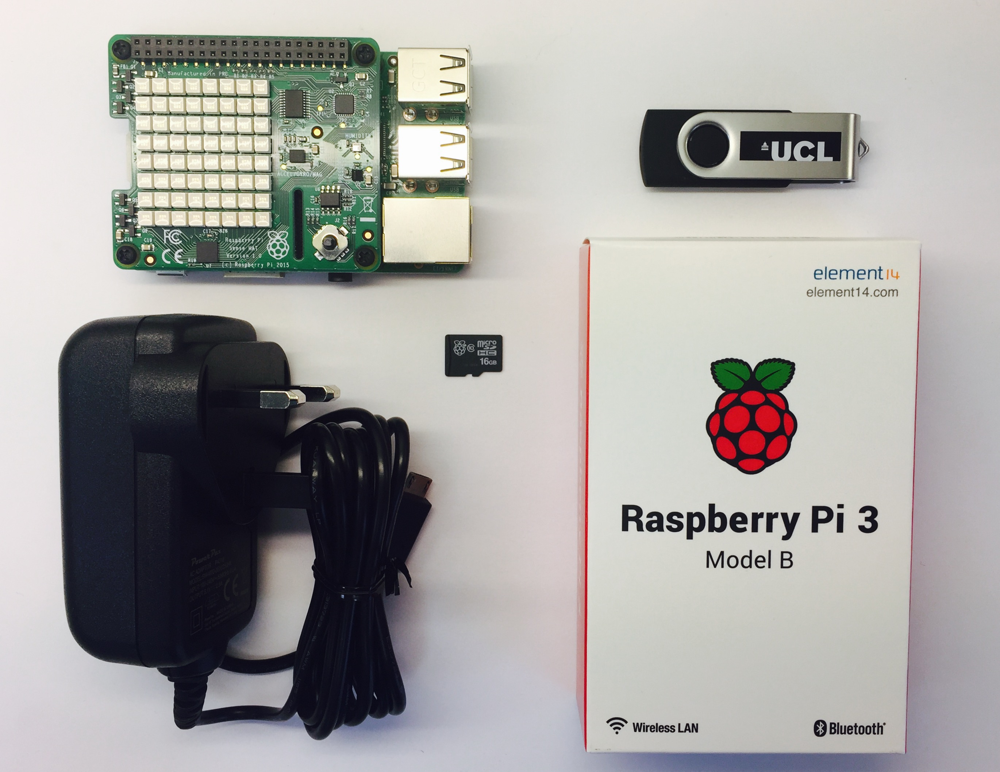

# Academic Leads Help Sheet
Go4Code Coding Summer School 22-24 August 2017

This sheet will guide you through what you should expect on the day and some possible troubleshooting answers.

## Timetable
| Day 1            |  Day 2             | Day 3            |
| -----------|-------------  ----  | ------------     |
| 10:00 - 11:00 Arrivals| 9:45 - 12:30 Project Work| 09:45 - 12:15 Project Work           |
| 11:00 - 11:45 Welcome Speeches and meet the ambassadors| 12:30 - 13:30 Lunch |12:15 - 12:30 Group Portrait|
| 12:30 - 13:00 Ice breakers|13:30 - 16:30 Project Work   | 12:30 - 13:15 Lunch with parents               |
|13:00 - 14:00 Introduction Lecture by Ishan Khurana|16:15 Students depart  |13:15 - 14:00 Science Fair|
|14:00- 16:00 Project Work|  |14:00 - 15:00 Panel Discussion with Jenny Sivapalan (Guardian), Jay  (UCL ExoPlanets), Simon Jolly (UCL Proton Beam Therapy)|
|16:15 Students depart||15:00-15:30 Evaluation and Certificates|

## Equipment
Each student will have:
* Raspberry Pi 3
* Sense HAT
* Power supply
* Pre-programmed SD card
* USB memory stick



The Raspberry Pi's and Sense HATs will be given pre-assembled to the students. The SD cards will already be on their holder in the Pi.

Each academic lead will have their own equipment so they can demonstrate the projects to the students. There is spare equipment if any appear faulty.

## Project Work
* Each academic lead will be look after a group of 5-6 students
* Programming language - Python 3
* Projects are available on: [Coding Summer School Webpage](https://codingsummerschool.github.io/codingsummerschool)
* Full solutions are available at: [Solutions](https://codingsummerschool.github.io/codingsummerschool/teachers/trinket_links.html)
* Projects are split into difficulties: easy, medium and hard

Students will be writing scripts on the Trinket Emulator to develop and debug using the skeleton code provided. To run code on the RPi they must create a python file by copying the code in *main.py* file in Trinket to a new file in IDLE and save this file as a *.py* file. The names mustn't contain spaces.

The RPi has been configured to copy the scripts from the memory stick over. If scripts with the same name are already on the Pi they will be overwritten.

Scripts will then be available to select their scripts from a digital list.

**Please familiarise yourself with the project scripts, this will help both the students and yourself!**

## Libraries and Skeleton Code


[The Function Reference Webpage](https://codingsummerschool.github.io/codingsummerschool/docs/function_reference.html) is a list of useful functions that students may wish to use.

You should be familiar with the function in the document above and the python API at: [pythonhosted.org/sense-hat/api/](https://pythonhosted.org/sense-hat/api/)

Skeleton code and object classes for projects will already be pre-loaded onto the Pi's.

## Day 1
* The programme will be introduced by Ishan at 13:00 in the Darwin Lecture Theatre.
* You must arrive at your resective cluster room by 13:30 to help the student ambassadors login to the computers and set up the room.
* Students will first work through the webpage. [Introduction to Python and Sense HAT page](https://codingsummerschool.github.io/codingsummerschool/docs/SenseHatIntro.html). It is important that students go through and understand the webpage as it is required to complete the projects.
* Variables and conditional statements are important concepts that the students need to be familiar with.
* The aim is to get each student to the end of the webpage by the end of session, so they are ready to start the projects the next day - students can start projects if they find the worksheet easy.

## Day 2
* Full day of project work.
* All students should of finished the introduction to programming webpage.

## Day 3
* Two hours of project work to finish projects.
* In the afternoon, the students will be showcasing their work in a Science fair to their parents.
* A panel discussion with 2 UCL academics and a software developer from the Guardian - this is a Q&A session between the students and the panel guests. Feel free to ask questions as well.


## Troubleshooting
Here is a list of potential problems that could occur:

* Script appears on the Raspberry Pi but does run the file as expected:
  - Check the script has the following lines at the start:

  ```python
  import sys (1,'home''/home/pi/.Go4Code/g4cSense/pong/skeleton')
  from sense_hat import SenseHat
  from pong import Pong
  import random
  from senselib import *
  ```
  - Sense HAT libraries need to be imported
  - Make sure indentation is correct. This is a very common error. If 2 space indentation doesn't work try 4 space.
  - This example comes from the pong project, which has a library and class in the skeleton code
  - Skeleton code can be found on the Trinket emulator which is on the project script page
* Encourage students to try things out by themselves


* Please either text Ishan (+44 7528692298) or call Laura (+44 7891138825) if you encounter any difficulties
